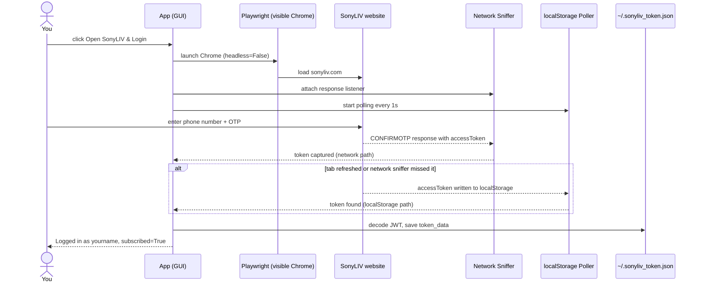
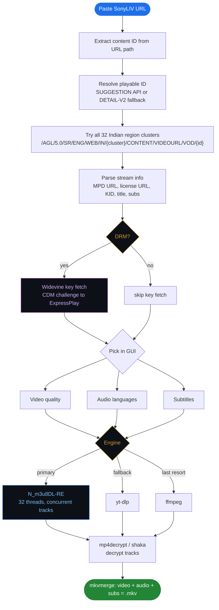
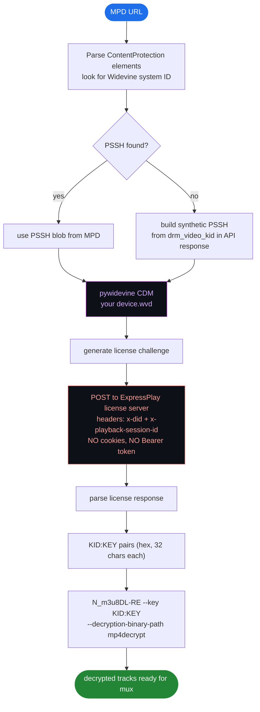

# SonyLIV Downloader

GUI tool to download SonyLIV movies and shows. Browser-based login, Widevine DRM decryption, multi-track audio, auto mux to MKV. One script, no browser extension needed.

**why one file?** intentional. no imports to chase, no `src/` folder maze, no `__init__.py` hell. clone it, run it, done. a kid with python installed can execute this in 30 seconds. modular is great for teams -- this is for one person who just wants their show downloaded.

> **Personal and educational use only. Read the [Disclaimer](#disclaimer) before anything else.**

---

## Demo

https://github.com/user-attachments/assets/9d551bb8-7648-46e5-831c-0e3d958e38d0

> some parts are blurred out -- personal info like phone number and account details, not hiding any steps lol

---

## Features

- phone OTP login, no password needed
- opens real Chrome for login, you do it yourself, token saves in the background
- auto detects DRM vs plain streams, handles both
- Widevine L3 key fetch using your own `.wvd` file
- shows all video qualities pulled live from the manifest
- pick audio languages: hi, te, ta, en, whatever the content has
- subtitle download (MPD-embedded + API-sourced VTT)
- N_m3u8DL-RE as primary engine, yt-dlp and ffmpeg as fallbacks
- auto mux to MKV after download
- tries all 32 Indian region clusters automatically
- dark GUI, no terminal after setup
- cancel anytime

---

## Token lasts 1 year

> **Log in once, done for a year.**
>
> The JWT Bearer token SonyLIV issues after OTP verification has a 1-year expiry. The app saves it to `~/.sonyliv_token.json` after first login. Every future session loads it automatically. No re-login until next year.

---

## How login works



> Chrome stays visible because Sony's Akamai bot detection blocks headless CDP automation. The app never touches your login form, it just watches what Sony sends back.

---

## Full download pipeline



---

## DRM decryption flow



> No cookies and no Bearer token on the license request because Akamai bot detection fires and returns 403 if you send them. Only `x-did` and `x-playback-session-id` go through.

---

## What you need

| thing | needed? | notes |
|---|---|---|
| Python 3.9+ | yes | |
| N_m3u8DL-RE | yes | multi-audio only works with this |
| ffmpeg | yes | required by N_m3u8DL-RE |
| mkvmerge | yes | final mux |
| Playwright + Chrome | yes | for browser login |
| `.wvd` device file | yes, for DRM | without this DRM streams won't decrypt |
| pywidevine | yes, for DRM | `pip install pywidevine` |
| mp4decrypt or shaka-packager | yes, for DRM | alternate decryptors |
| requests | optional | urllib used as fallback |

---

## Setup

### 1. Python

[python.org/downloads](https://www.python.org/downloads/) -- tick "Add Python to PATH" during install

### 2. Clone

```bash
git clone https://github.com/arvind88765/sonyliv-downloader
cd sonyliv-downloader
```

### 3. Install Python deps

```bash
pip install playwright pywidevine requests
python -m playwright install chrome
```

### 4. ffmpeg

Download from [gyan.dev/ffmpeg/builds](https://www.gyan.dev/ffmpeg/builds/), grab `ffmpeg-release-full.7z`, extract, add the `bin` folder to PATH. Or paste the full path in Settings.

### 5. N_m3u8DL-RE

Go to [github.com/nilaoda/N_m3u8DL-RE/releases](https://github.com/nilaoda/N_m3u8DL-RE/releases), grab `N_m3u8DL-RE_Beta_win-x64.zip`, pull out the exe, paste its path in Settings.

Multi-audio only works with this. yt-dlp and ffmpeg are backups. On a 90 mbps connection a 1hr episode takes around 20s with N_m3u8DL-RE vs 3+ minutes with ffmpeg alone.

### 6. WVD device file (mandatory for DRM content)

A `.wvd` file is a Widevine **L3 software CDM** device. The app uses it to talk to SonyLIV's license server and get decryption keys. Without it, DRM content downloads but stays encrypted and won't play.

> **L3 CDM is required.** You need to dump your own from an Android device or emulator. The app will not work on DRM content without a valid `.wvd` file.
>
> Guide to dump your own L3 CDM: [Dumping Your own L3 CDM with Android Studio](https://forum.videohelp.com/threads/408031-Dumping-Your-own-L3-CDM-with-Android-Studio)

Once you have the `.wvd` file:

1. Put it somewhere safe (e.g. `C:\device.wvd`)
2. Open the app, go to Settings
3. Paste the path in the WVD Device File field
4. Save

Keys are fetched fresh every download using your login token. Nothing is stored.

### 7. Run

```bash
python sonyliv_gui.py
```

---

## How to use

**Login tab**
1. Click **Open SonyLIV & Login**
2. Chrome opens, log in with phone number and OTP
3. Close Chrome when status says "Logged in as..."
4. Token saved, good for a year

**Download tab**
1. Paste a SonyLIV URL, click **Fetch Info**
2. Check DRM status, pick quality + audio + subs
3. Hit **Download**

**Settings tab** -- first thing you do after install. Set the paths to all external tools here. Saves automatically.

| field | what to put |
|---|---|
| N_m3u8DL-RE path | full path to the `.exe` (e.g. `C:\tools\N_m3u8DL-RE.exe`) |
| ffmpeg path | full path to `ffmpeg.exe` or just `ffmpeg` if it's in PATH |
| mkvmerge path | full path to `mkvmerge.exe` or just `mkvmerge` if it's in PATH |
| WVD Device File | full path to your `.wvd` file (e.g. `C:\device.wvd`) |
| mp4decrypt path | full path to `mp4decrypt.exe` or leave blank if using shaka |
| Output directory | where downloaded MKVs go, default is `~/Downloads/SonyLIV` |
| Thread count | 32 by default, lower it if your connection struggles |
| Engine | N_m3u8DL-RE is fastest, yt-dlp and ffmpeg are fallbacks |
| DRM tool | auto picks mp4decrypt first, falls back to shaka |

---

## Supported URLs

```
https://www.sonyliv.com/movies/movie-name-1234567
https://www.sonyliv.com/shows/show-name-111/episode-title-222?watch=true
https://www.sonyliv.com/sports/event-name-333
```

---

## Config reference

Stored at `~/.sonyliv_downloader.json`:

| Key | Default | What it does |
|-----|---------|--------------|
| `token_file` | `~/.sonyliv_token.json` | Where the JWT token lives |
| `output_dir` | `~/Downloads/SonyLIV` | Where downloads go |
| `n_m3u8dl_exe` | `N_m3u8DL-RE` | Path to N_m3u8DL-RE binary |
| `ffmpeg_exe` | `ffmpeg` | ffmpeg binary |
| `mkvmerge_exe` | `mkvmerge` | mkvmerge binary |
| `wvd_file` | *(blank)* | Path to your .wvd Widevine device file |
| `mp4decrypt_exe` | `mp4decrypt` | mp4decrypt binary |
| `shaka_exe` | `shaka-packager` | shaka-packager binary |
| `thread_count` | `32` | Segment download thread count |
| `engine` | `N_m3u8DL-RE` | Download engine: `N_m3u8DL-RE`, `yt-dlp`, `ffmpeg` |
| `drm_tool` | `auto` | Decryption tool: `auto`, `mp4decrypt`, `shaka` |

---

## Troubleshooting

**All clusters fail**
Look for `[DBG/...]` lines in the log. Common causes:
- Token expired -- re-login from the Login tab
- `isMaxLoginConcurrencyReached` in JWT -- log out of other devices in the SonyLIV app first

**Playwright or Chrome not found**
```bash
pip install playwright
python -m playwright install chrome
```

**No Widevine key / DRM fails**
- Set `wvd_file` in Settings to a valid `.wvd` file
- Install pywidevine: `pip install pywidevine`
- You need an L3 CDM -- dump your own using this guide: [Dumping Your own L3 CDM with Android Studio](https://forum.videohelp.com/threads/408031-Dumping-Your-own-L3-CDM-with-Android-Studio)
- L1-protected titles will not work with an L3 WVD device

**MKV not created after download**
- Make sure mkvmerge is installed and in PATH, or set full path in Settings
- Check the log for `[MKV]` lines

---

## Disclaimer

This tool is for personal and educational use only.

- You need an active SonyLIV subscription to use this
- Downloading DRM-protected content may violate SonyLIV's [Terms of Service](https://www.sonyliv.com/termsofuse)
- Do not distribute anything you download
- The `.wvd` Widevine device file is not provided and must be sourced by you
- The authors take no responsibility for how this tool is used
